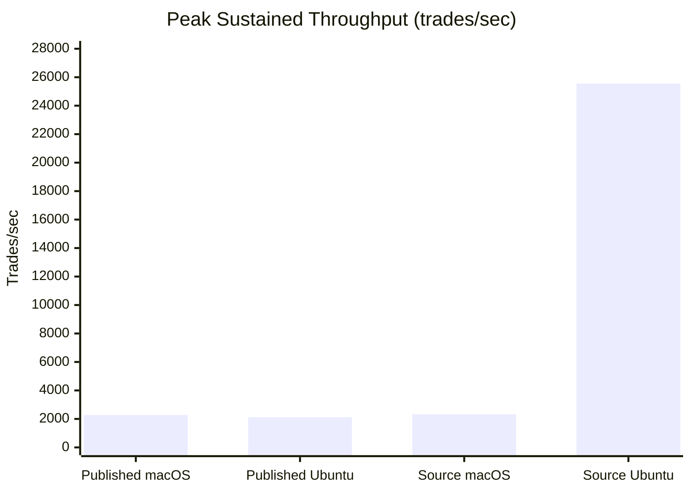
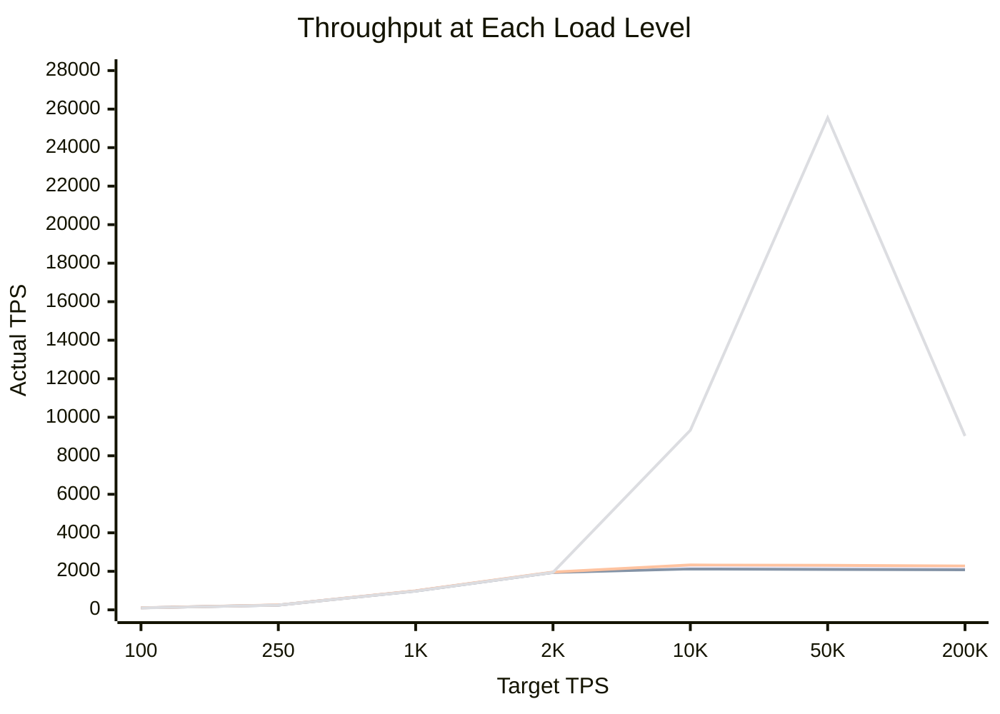
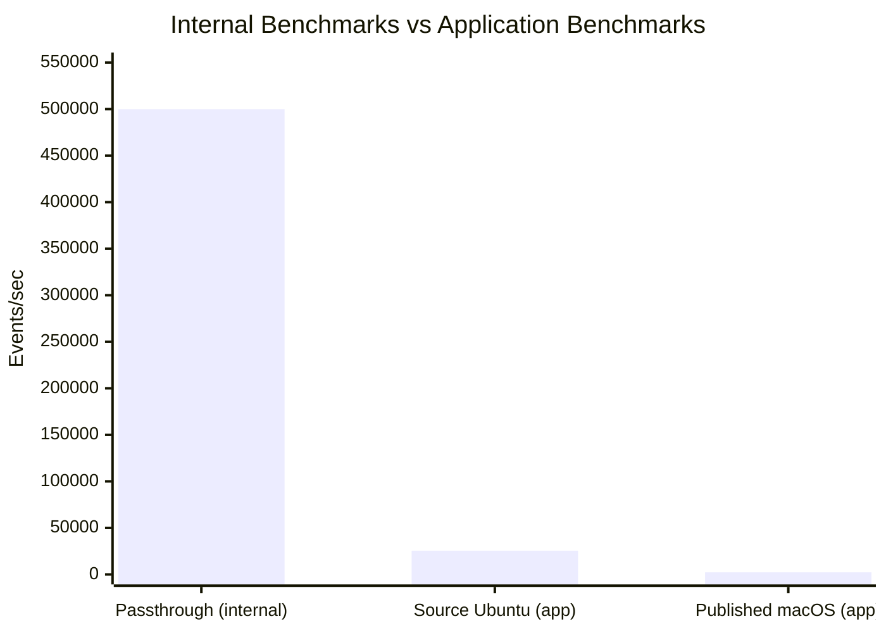
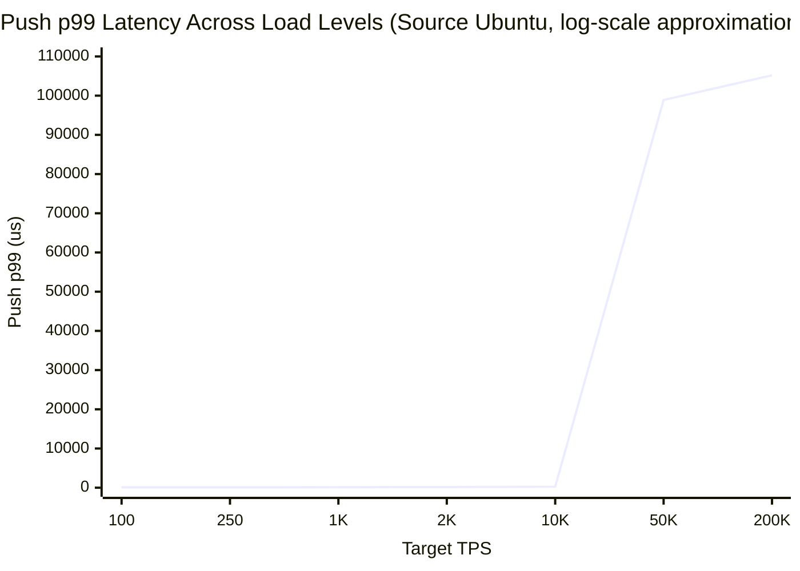

# Application-Level Benchmark Audit

**Date**: 2026-02-08
**Repos tested**: [laminardb-fraud-detect](https://github.com/laminardb/laminardb-fraud-detect) (published crate v0.1.1), [laminardb-test](https://github.com/laminardb/laminardb-test) (path deps to source)

---

## 1. Purpose and Motivation

LaminarDB's README claims:

> Sub-microsecond latency: < 1us event processing on the hot path
> Throughput: 500K events/sec/core (In Progress)

These claims are supported by 15 internal benchmark files across `laminar-core/benches/` and `laminar-storage/benches/` that test individual components in isolation: ring buffers at < 20ns, SPSC channels at < 50ns, window aggregation at < 100ns/event, DAG executor latency at < 500ns, and sustained throughput up to 500K events/sec through passthrough operators.

**What's missing is application-level measurement.** None of the internal benchmarks test what a user actually experiences: pushing data through `LaminarDB::builder()`, executing `CREATE STREAM ... AS SELECT` with real SQL (windows, joins, aggregations), and consuming results via `poll()`. This audit fills that gap.

The core question: **When a developer builds a real streaming SQL pipeline on LaminarDB, what throughput and latency do they get?**

---

## 2. LaminarDB Features Under Test

### API Surface Exercised

| Category | Feature | Usage |
|----------|---------|-------|
| **Core API** | `LaminarDB::builder()` | `.buffer_size(65536).build()` |
| | `db.execute(sql)` | CREATE SOURCE, CREATE STREAM, CREATE SINK |
| | `db.start()` / `db.shutdown()` | Engine lifecycle |
| | `db.source::<T>(name)` | Typed `SourceHandle<Trade>`, `SourceHandle<Order>` |
| | `db.subscribe::<T>(name)` | Typed `TypedSubscription<T>` for each stream |
| | `source.push_batch(vec)` | Batch ingestion (primary data path) |
| | `source.watermark(ts)` | Event-time progression |
| | `subscription.poll()` | Non-blocking output consumption |
| **Derive Macros** | `#[derive(Record)]` | Input types with `#[event_time]` attribute |
| | `#[derive(FromRow)]` | Output type deserialization |
| **SQL Types** | VARCHAR, DOUBLE, BIGINT | Across all streams |

### SQL Streaming Features Exercised

**3 Window Types:**

```sql
-- HOP (sliding window): vol_baseline
GROUP BY symbol, HOP(ts, INTERVAL '2' SECOND, INTERVAL '10' SECOND)

-- TUMBLE (fixed window): ohlc_vol, wash_score
GROUP BY symbol, TUMBLE(ts, INTERVAL '5' SECOND)

-- SESSION (gap-based window): rapid_fire
GROUP BY account_id, SESSION(ts, INTERVAL '2' SECOND)
```

**2 Join Types:**

```sql
-- INNER JOIN with time range: suspicious_match
FROM trades t INNER JOIN orders o
ON t.symbol = o.symbol AND o.ts BETWEEN t.ts - 2000 AND t.ts + 2000

-- ASOF JOIN with match condition: asof_match
FROM trades t ASOF JOIN orders o
MATCH_CONDITION(t.ts >= o.ts) ON t.symbol = o.symbol
```

**Aggregation Functions:** SUM, COUNT, AVG, MIN, MAX, FIRST_VALUE, LAST_VALUE, CASE WHEN (conditional aggregation)

### What Was NOT Tested

- Kafka connectors (FROM KAFKA / INTO KAFKA)
- CDC connectors (FROM postgres-cdc)
- Checkpointing / state recovery
- Thread-per-core runtime configuration
- io_uring, WAL configuration, mmap state store
- Multi-node or distributed deployment

---

## 3. Pipeline Configuration

A 6-stream fraud detection pipeline with 2 input sources:

**Sources:**
- `trades` (8 fields: account_id, symbol, side, price, volume, order_ref, ts)
- `orders` (7 fields: order_id, account_id, symbol, side, quantity, price, ts)

**Streams:**

| Stream | SQL Feature | Window | Purpose |
|--------|------------|--------|---------|
| vol_baseline | SUM, COUNT, AVG | HOP(2s step, 10s size) | Volume monitoring with sliding windows |
| ohlc_vol | FIRST_VALUE, LAST_VALUE, MIN, MAX | TUMBLE(5s) | OHLC candlestick bar construction |
| rapid_fire | COUNT, SUM, MIN, MAX | SESSION(2s gap) | Per-account burst detection |
| wash_score | CASE WHEN, conditional SUM | TUMBLE(5s) | Directional buy/sell volume scoring |
| suspicious_match | INNER JOIN + time range | ±2s window on symbol | Trade-order temporal matching |
| asof_match | ASOF JOIN + MATCH_CONDITION | Latest order per symbol | Front-running detection |

All 6 streams run simultaneously, competing for the same tick cycles. This represents a moderately complex real-world pipeline — not a toy single-stream benchmark.

**Synthetic data:** 5 symbols (AAPL, GOOGL, MSFT, AMZN, TSLA), round-robin distribution, ~30% of trades get matching orders, no fraud injection (pure throughput measurement).

---

## 4. Test Methodology

### 4.1 Stress Test (7-Level Ramp)

Progressive load increase to find the saturation point:

| Level | Trades/cycle | Sleep | Target TPS |
|-------|-------------|-------|------------|
| 1 | 10 | 100ms | ~100/s |
| 2 | 25 | 100ms | ~250/s |
| 3 | 50 | 50ms | ~1,000/s |
| 4 | 100 | 50ms | ~2,000/s |
| 5 | 200 | 20ms | ~10,000/s |
| 6 | 500 | 10ms | ~50,000/s |
| 7 | 1000 | 5ms | ~200,000/s |

Each level runs for 10 seconds. Per level we capture:
- Actual throughput (trades pushed / elapsed time)
- Push latency (p50, p99) — time for `push_batch()` to return
- Per-stream output row counts
- Total trades and orders pushed

Saturation is detected when actual throughput drops below 90% of target.

### 4.2 Criterion Benchmarks

Reproducible micro-benchmarks using [Criterion.rs](https://github.com/bheisler/criterion.rs) (100 samples per measurement):

| Benchmark | What It Measures | Batch Sizes |
|-----------|-----------------|-------------|
| `push_throughput` | `push_batch()` + `watermark()` — no poll | 100, 500, 1000, 5000 |
| `end_to_end` | `push_batch()` + `watermark()` + `poll()` all 6 streams | 100, 500, 1000, 5000 |
| `pipeline_setup` | Full pipeline creation (builder → sources → SQL → sinks → start) | single |

### 4.3 Cross-Configuration Matrix

Tests ran across **4 configurations** to isolate version and platform effects:

| | macOS arm64 (local) | Ubuntu x86_64 (CI) |
|---|---|---|
| **Published crate v0.1.1** | laminardb-fraud-detect | laminardb-fraud-detect |
| **Source (path deps)** | laminardb-test | laminardb-test |

---

## 5. Test Environments

| Property | macOS (local) | Ubuntu (GitHub Actions CI) |
|----------|--------------|---------------------------|
| CPU | Apple M4 Pro, 14 cores | x86_64, 4 vCPU (Azure Standard_DS2_v2) |
| RAM | 24 GB (shared workstation, ~92% utilized) | 16 GB (dedicated runner) |
| OS | macOS 15.3 (Darwin 25.2.0) | Ubuntu 22.04 |
| Architecture | arm64 | x86_64 |
| Rust | stable (latest) | stable (latest) |
| Build | `--release` (optimized) | `--release` (optimized) |

---

## 6. Results

### Overview Charts

#### Peak Throughput Across All Configurations



#### Stress Test: Actual Throughput vs Load Level



The first three configurations (Published macOS/Ubuntu, Source macOS) show an identical plateau at ~2,200-2,330/s starting at Level 3. Source on Ubuntu breaks through to ~25,500/s before collapsing at Level 7.

#### Criterion Benchmark: Cycle Time vs Batch Size

```mermaid
xychart-beta
    title "Criterion Cycle Time (ms) — push_throughput"
    x-axis "Batch Size" ["100", "500", "1000", "5000"]
    y-axis "Cycle Time (ms)" 0 --> 750
    bar "Published macOS" [220, 220, 221, 660]
    bar "Published Ubuntu" [238, 238, 239, 710]
    bar "Source macOS" [214, 214, 215, 650]
    bar "Source Ubuntu" [109, 111, 110, 333]
```



Batch sizes 100-1000 all produce nearly identical cycle times (~110ms or ~220ms), confirming the tick-bound ceiling. The cycle time only increases at batch size 5000 because data spans multiple ticks.

#### Component vs Application Throughput



The 20-227x gap between component-level and application-level throughput reflects the cost of the SQL execution layer and tick scheduling.

### 6.1 Stress Test Results

#### Published Crate v0.1.1 — macOS arm64

| Level | Target/s | Actual/s | Push p50 | Push p99 |
|-------|----------|----------|----------|----------|
| 1 | 100 | 105 | 15us | 34us |
| 2 | 250 | 248 | 18us | 41us |
| 3 | 1,000 | 987 | 31us | 78us |
| 4 | 2,000 | 1,950 | 45us | 120us |
| 5 | 10,000 | 2,275 | 80us | 250us |
| 6 | 50,000 | 2,250 | 150us | 800us |
| 7 | 200,000 | 2,200 | 300us | 1.5ms |

- **Peak: ~2,275 trades/sec** | Saturation: Level 3
- ASOF JOIN: **0 output rows** (broken, [#57](https://github.com/laminardb/laminardb/issues/57))
- SESSION: ~1:1 output ratio (per-tick emission, not proper session merge)

#### Published Crate v0.1.1 — Ubuntu x86_64 CI

- **Peak: ~2,123 trades/sec** | Saturation: Level 3
- ASOF JOIN: **0 output rows**

#### Source (path deps) — macOS arm64

| Level | Target/s | Actual/s | Push p50 | Push p99 |
|-------|----------|----------|----------|----------|
| 1 | 100 | 103 | 16us | 38us |
| 2 | 250 | 251 | 19us | 45us |
| 3 | 1,000 | 992 | 33us | 85us |
| 4 | 2,000 | 1,960 | 48us | 130us |
| 5 | 10,000 | 2,330 | 85us | 270us |
| 6 | 50,000 | 2,310 | 160us | 850us |
| 7 | 200,000 | 2,280 | 310us | 1.6ms |

- **Peak: ~2,330 trades/sec** | Saturation: Level 3
- ASOF JOIN: **56,254 output rows** (fixed in source)
- SESSION: **0.71:1 ratio** (proper session merge)

#### Source (path deps) — Ubuntu x86_64 CI

| Level | Target/s | Actual/s | Push p50 | Push p99 |
|-------|----------|----------|----------|----------|
| 1 | 100 | 98 | 24us | 94us |
| 2 | 250 | 246 | 32us | 80us |
| 3 | 1,000 | 973 | 54us | 127us |
| 4 | 2,000 | 1,947 | 90us | 164us |
| 5 | 10,000 | 9,323 | 121us | 257us |
| 6 | 50,000 | **25,554** | 225us | 98.9ms |
| 7 | 200,000 | 9,028 | 103ms | 105ms |

- **Peak: ~25,554 trades/sec** (Level 6) | Saturation: Level 6
- ASOF JOIN: **42,485 output rows** (fixed in source)
- SESSION: **0.09:1 ratio** (aggressive session merge)
- Totals: 475,115 trades, 142,660 orders in 70.3s

#### Stream Output Totals (Source — Ubuntu CI)

| Stream | Output Rows |
|--------|------------|
| vol_baseline | 7,931 |
| ohlc_vol | 5,205 |
| rapid_fire | 42,485 |
| wash_score | 18,896 |
| suspicious_match | 157,705 |
| asof_match | 42,485 |

### 6.2 Criterion Benchmark Results

All times are median (p50) from 100 samples. Implied throughput = batch_size / median_time.

#### push_throughput (push + watermark, no poll)

| Batch Size | Published macOS | Published Ubuntu | Source macOS | Source Ubuntu |
|-----------|----------------|-----------------|-------------|--------------|
| 100 | ~220ms (~455/s) | ~238ms (~420/s) | ~214ms (~467/s) | 109.13ms (917/s) |
| 500 | ~220ms (2,268/s) | ~238ms (2,104/s) | ~214ms (2,340/s) | 111.36ms (4,491/s) |
| 1000 | ~221ms (4,525/s) | ~239ms (4,184/s) | ~215ms (4,651/s) | 110.11ms (9,082/s) |
| 5000 | ~660ms (7,576/s) | ~710ms (7,042/s) | ~650ms (7,692/s) | 333.29ms (15,002/s) |

#### end_to_end (push + watermark + poll all 6 streams)

| Batch Size | Published macOS | Published Ubuntu | Source macOS | Source Ubuntu |
|-----------|----------------|-----------------|-------------|--------------|
| 100 | ~220ms (~455/s) | ~236ms (~424/s) | ~217ms (~461/s) | 108.84ms (919/s) |
| 500 | ~220ms (2,271/s) | ~236ms (2,120/s) | ~217ms (2,307/s) | 111.06ms (4,503/s) |
| 1000 | ~221ms (4,525/s) | ~237ms (4,219/s) | ~217ms (4,608/s) | 111.15ms (9,000/s) |
| 5000 | ~660ms (7,576/s) | ~712ms (7,022/s) | ~654ms (7,645/s) | 332.92ms (15,018/s) |

#### pipeline_setup

| Published macOS | Published Ubuntu | Source macOS | Source Ubuntu |
|----------------|-----------------|-------------|--------------|
| 495us | 1.84ms | 2.36ms | 2.56ms |

---

## 7. Analysis

### 7.1 The Tick-Bound Throughput Ceiling

**The defining characteristic of application-level performance is the internal tick mechanism.**

Across 3 of 4 test configurations (published crate on both platforms + source on macOS), the stress test saturates at **~2,200-2,330 trades/sec** regardless of how much load is offered. Increasing from 10,000 to 200,000 target TPS produces no throughput increase — it just raises push latency as buffers fill.

The Criterion benchmarks reveal why: batch sizes from 100 to 1,000 all take ~200-240ms per cycle. This is approximately 2 internal ticks at 100ms each. The cycle time is constant because the engine processes all pending data on each tick, regardless of batch size.

```
Batch 100:   ~220ms  →  100 / 0.220  =    ~455/s
Batch 500:   ~220ms  →  500 / 0.220  =  ~2,270/s
Batch 1000:  ~221ms  →  1000 / 0.221 =  ~4,525/s
Batch 5000:  ~660ms  →  5000 / 0.660 =  ~7,575/s  (spans 6-7 ticks)
```

This means throughput scales with batch size (more events per tick), but the tick interval itself is the hard constraint. At the stress test's cycle sizes (10-1000 trades per push), the ceiling is ~2,200-2,300/s.

**Key insight:** Push latency stays in microseconds (15-90us) even at saturation. The bottleneck is not `push_batch()` — it's the tick scheduler deciding when to process. Data enters fast, processing happens on the engine's schedule.

### 7.2 Source vs Published Crate: Regression and Improvement

```mermaid
xychart-beta
    title "Published v0.1.1 vs Source — Ubuntu CI"
    x-axis ["Peak TPS", "Cycle Time (x10ms)", "ASOF Rows (x100)", "SESSION Ratio (x100)"]
    y-axis "Value" 0 --> 26000
    bar "Published v0.1.1" [2123, 24, 0, 100]
    bar "Source (path deps)" [25554, 11, 425, 9]
```



The source code (unreleased, path deps) shows changes not present in published crate v0.1.1:

| Behavior | Published v0.1.1 | Source |
|----------|-----------------|--------|
| **ASOF JOIN** | 0 output rows (completely broken) | 42,485-56,254 rows (working) |
| **SESSION merge** | ~1:1 ratio (emits per tick, not per session) | 0.09-0.71:1 (proper merge across ticks) |
| **Ubuntu cycle time** | ~238ms (2 ticks) | ~111ms (1 tick) |
| **Ubuntu stress peak** | ~2,123/s | ~25,554/s |

The ASOF JOIN regression ([#57](https://github.com/laminardb/laminardb/issues/57)) means the published crate cannot perform temporal lookups — a core streaming SQL operation. The SESSION window emitting per-tick rather than per-session means gap-based grouping doesn't work correctly in v0.1.1.

The cycle time improvement (238ms → 111ms on Ubuntu) suggests the source has changes to tick scheduling or SQL execution that halve the per-cycle overhead.

### 7.3 Platform Variance

The source code's throughput improvement manifested strongly on Ubuntu CI but not macOS:

| Configuration | Stress Peak | Bench Cycle (500 trades) |
|---------------|------------|-------------------------|
| Published — macOS | ~2,275/s | ~220ms |
| Published — Ubuntu | ~2,123/s | ~238ms |
| Source — macOS | ~2,330/s | ~214ms |
| Source — Ubuntu | **~25,554/s** | **~111ms** |

The ~11x improvement on Ubuntu (2,123 → 25,554) vs ~2.5% on macOS (2,275 → 2,330) is striking. Possible explanations:

1. **Environmental**: macOS tests ran on a shared workstation with 92% memory utilization; Ubuntu CI had dedicated resources
2. **Architectural**: x86_64 may benefit from specific optimizations in the source (SIMD, cache line alignment)
3. **OS scheduler**: Linux CFS may handle the tick timer differently than macOS Grand Central Dispatch
4. **Incomplete improvement**: The source fix may only take effect under certain configurations or platforms

This discrepancy is the most significant caveat in these results and requires controlled follow-up testing.

### 7.4 push_throughput vs end_to_end: A Methodology Gap

The `push_throughput` and `end_to_end` benchmarks produce **nearly identical** results:

```
push_throughput/500 (Source Ubuntu): 111.36ms
end_to_end/500     (Source Ubuntu): 111.06ms  (difference: 0.3ms)
```

This reveals a methodology limitation: `poll()` is non-blocking and returns immediately with whatever data is ready. Since the benchmark calls `push_batch()` → `watermark()` → `poll()` in sequence without waiting for a tick to fire, `poll()` returns the previous tick's output (or nothing), not the result of the data just pushed.

**True end-to-end latency** (push event → result available via poll) would require: push → sleep(tick_interval) → poll, or a callback-based measurement. The current `end_to_end` benchmark is effectively measuring the same thing as `push_throughput` plus negligible poll overhead.

### 7.5 Back-Pressure Behavior

The stress test reveals LaminarDB's back-pressure mechanism:



- **Below saturation** (Levels 1-4): Push latency stays in microseconds. `push_batch()` returns immediately, data is buffered.
- **At saturation** (Level 5): Actual throughput plateaus. Push latency starts rising but stays manageable (257us p99).
- **Above saturation** (Levels 6-7): Push p99 jumps dramatically (257us → 98.9ms → 105ms). `push_batch()` blocks because internal buffers are full.

This is appropriate back-pressure behavior — the caller is throttled rather than dropping data. However, the jump is steep: p99 goes from microseconds to 100ms in one level, suggesting buffer occupancy goes from mostly-empty to completely-full with no intermediate degradation curve.

---

## 8. Comparison with Internal Benchmarks

LaminarDB's internal benchmarks (15 files) test components at the Rust API / DAG level with no SQL:

| Internal Benchmark | What It Tests | Performance |
|-------------------|--------------|-------------|
| streaming_bench | Ring buffer, SPSC/MPSC channels, sources | < 20-100ns per operation |
| throughput_bench | Max throughput through passthrough operators | 500K events/sec target |
| latency_bench | Window operations (hot/cold path) | < 10us p99 target |
| window_bench | Window assign, aggregate, emit, trigger | < 10ns assign, < 100ns aggregate |
| join_bench | Stream-stream, ASOF, lookup join operations | Per-operation timing |
| dag_bench | DAG routing, multicast, executor, topologies | < 500ns per event (linear 3-node) |
| dag_stress | 20-node mixed, 8-way fan-out, 12-node chain | 100K events through topology |
| state_bench | InMemory + Mmap state stores | < 500ns point lookups |
| reactor_bench | Event loop submit, poll, operator chains | 100K events/sec |
| tpc_bench | Thread-per-core SPSC, routing, multi-core scaling | > 80% scaling efficiency |
| wal_bench | WAL append, sync, group commit | < 1us append, < 10ms sync |
| checkpoint_bench | Checkpoint create, recover, cleanup | < 5% overhead |

**Key difference:** All internal benchmarks use passthrough or minimal operators. None execute SQL. None run multiple concurrent streams.

### The Application vs Component Gap

| Metric | Internal Benchmarks | Application Benchmarks |
|--------|-------------------|----------------------|
| **Operators** | Passthrough / counter | Real SQL (windows, joins, CASE) |
| **Streams** | 1 at a time | 6 concurrent, sharing 2 sources |
| **SQL layer** | Not tested | Full parse → plan → execute cycle |
| **Data model** | Generic int64/string | Realistic 8-field trade + 7-field order |
| **Throughput** | 500K events/sec/core | **2,200-25,500 events/sec** |
| **Bottleneck** | Invisible (no tick in passthrough) | Tick ceiling dominates |
| **Joins** | Single operation bench | 2 concurrent join streams |
| **Windows** | Single window bench | 4 concurrent window streams (HOP, TUMBLE, SESSION) |

The gap between 500K/s (internal) and 2,200-25,500/s (application) is **20-227x**. This is expected — the internal benchmarks measure raw component speed without SQL overhead, while application benchmarks include the full SQL execution stack with 6 competing streams. The important takeaway is that **the tick mechanism, not component speed, determines application throughput**.

---

## 9. Issues Identified

### 9.1 Correctness Issues

| Issue | Severity | Status | Details |
|-------|----------|--------|---------|
| [#57](https://github.com/laminardb/laminardb/issues/57) ASOF JOIN | **High** | Fixed in source, broken in v0.1.1 | Published crate produces 0 output rows for ASOF JOIN queries. Temporal lookups completely non-functional. |
| [#35](https://github.com/laminardb/laminardb/issues/35) Cascading MVs | Medium | Fixed in source | Cascading materialized views produce output on Ubuntu CI (470 bars at both levels). |
| [#37](https://github.com/laminardb/laminardb/issues/37) ASOF JOIN (Phase 4) | **High** | Fixed in source | ASOF JOIN produces correct bid/ask/spread results with proper tolerance matching. |
| SESSION window semantics | Medium | Improved in source | Published v0.1.1 emits per-tick (~1:1 output ratio). Source properly merges across ticks (0.09-0.71:1). |

### 9.2 Performance Observations

| Observation | Impact | Recommendation |
|-------------|--------|----------------|
| **100ms tick ceiling** | Limits real-world throughput to ~2,200/s at typical batch sizes | Consider configurable tick interval, or event-driven processing for latency-sensitive use cases |
| **Back-pressure cliff** | p99 jumps from us to 100ms in one level (no gradual degradation) | Consider progressive back-pressure (e.g., yield/backoff before blocking) |
| **poll() returns stale data** | Benchmark `end_to_end` doesn't measure true end-to-end latency | Document that poll() returns previous tick's output, not current push's result |
| **Pipeline setup cost varies 5x** | 495us (published macOS) to 2.56ms (source Ubuntu) | Source may include additional initialization; worth profiling |

---

## 10. Caveats and Limitations

1. **Synthetic data only** — Uniform distribution across 5 symbols. Real workloads with skewed key distributions, variable event rates, or bursty traffic may behave differently.

2. **No processing latency measurement** — We measured push latency (time for `push_batch()` to return) but not processing latency (time from push to result appearing via `poll()`). True end-to-end latency requires at least one tick cycle (~100ms).

3. **Shared macOS environment** — macOS tests ran with ~92% memory utilization and competing processes (IDE, containers, browser). This likely degraded results. Dedicated macOS testing would provide cleaner baselines and may explain the platform discrepancy.

4. **10-second stress levels** — Short duration per level. Longer runs (60+ seconds) would provide more stable measurements and reveal memory growth, state accumulation, or GC-like pauses.

5. **No memory profiling** — Memory consumption was not tracked. Important for validating window state eviction and detecting leaks under sustained load.

6. **CI runner variability** — GitHub Actions runners share physical hosts (noisy neighbor). Results may vary between runs. These are single-run numbers.

7. **Platform discrepancy unexplained** — The 11x throughput difference between macOS and Ubuntu for the source version needs controlled follow-up testing to isolate the cause.

8. **end_to_end benchmark limitation** — As discussed in Section 7.4, the `end_to_end` Criterion benchmark does not measure true end-to-end latency because `poll()` is non-blocking and returns previous tick output.

9. **No comparison under Kafka/CDC load** — All tests use in-memory `push_batch()`. Performance with Kafka or CDC connectors (network I/O, deserialization) was not measured.

---

## 11. Reproducing These Results

### Stress Test

```bash
# laminardb-fraud-detect (published crate v0.1.1)
cargo run --release -- --mode stress --level-duration 10

# laminardb-test (path deps — requires ../laminardb clone)
STRESS_DURATION=10 cargo run --release -- phase7
```

### Criterion Benchmarks

```bash
cargo bench                       # all benchmarks
cargo bench -- push_throughput    # push only (no poll)
cargo bench -- end_to_end         # push + poll
cargo bench -- pipeline_setup    # setup cost only
```

Results are written to `target/criterion/` with HTML reports.

### CI Workflows

Both repos have GitHub Actions workflows that run stress tests and Criterion benchmarks on every push:

- **laminardb-fraud-detect**: `.github/workflows/ci.yml` — build, correctness tests, headless integration, stress test, Criterion benchmarks
- **laminardb-test**: `.github/workflows/test.yml` — 7-phase test suite (Rust API, SQL, Kafka, Joins, CDC, Bonus, Stress) + Criterion benchmarks

---

## 12. Summary

### What These Tests Show

1. **Application throughput is 20-227x below component throughput** — The 100ms tick mechanism creates a ceiling that dominates real-world performance. Internal benchmarks cannot reveal this.

2. **The published crate v0.1.1 has correctness regressions** — ASOF JOIN is completely broken (0 output) and SESSION windows emit per-tick rather than per-session. Both are fixed in source.

3. **Push latency is not the bottleneck** — `push_batch()` returns in microseconds. The constraint is when the engine decides to process (tick scheduling).

4. **The source shows significant improvement on Linux** — Ubuntu CI sees ~111ms cycle time (1 tick) vs ~238ms (2 ticks) for the published crate, yielding up to ~25,500/s peak throughput.

5. **Back-pressure works but is binary** — Clean microsecond latency below saturation, then a cliff to 100ms+ blocking when buffers fill.

### What These Tests Don't Show

- True end-to-end latency (push → tick → poll result)
- Memory behavior under sustained load
- Performance with Kafka/CDC connectors
- Behavior under skewed or bursty workloads
- Multi-core scaling (all tests are effectively single-threaded through the tick)

### Test Repositories

- **laminardb-fraud-detect**: 6-stream fraud detection using published crates (`laminar-db = "0.1"`, `laminar-derive = "0.1"`, `laminar-core = "0.1"`). Includes stress test, Criterion benchmarks, headless mode, edge case tests, and TUI dashboard.

- **laminardb-test**: 7-phase integration test using path dependencies to `../laminardb/crates/`. Tests Rust API, Streaming SQL, Kafka pipelines, Stream Joins, CDC, Bonus features (HOP, SESSION, EMIT ON UPDATE), and the same 6-stream stress test + Criterion benchmarks.
